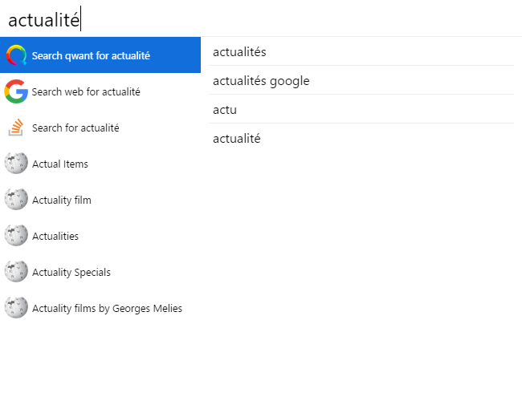

# Cerebro-Qwant

> A Cerebro plugin to look up Qwant

*Based on the idea from [Cerebro-Google](https://github.com/KELiON/cerebro-google)*

## Usage
Type any word you'd like to search!

## Features

* Get related content suggestions from Qwant

## TODO

- [ ] Cleanup the code
- [ ] Maybe use Qwant previews

## License

MIT